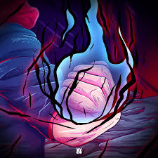

<div align="center">


<br>

<table border="0" width="100%" cellpadding="0" cellspacing="0">
<tr>
<td width="30%" valign="top" align="left">
<h4><font color="#00D4FF">〔 🗞️ METRON NEWSLETTER 〕</font></h4>
<code>$ tail -n 5 /logs/newsletter.feed</code><br>
<br>

</td>
<td width="40%" align="center" valign="middle">

<br>
<code>UNIT-ID: EIE101-BLUEPRINT</code>
</td>
<td width="30%" valign="top" align="right">
<h4><font color="#FF69B4">〔 ⚡ SYSTEM VITALITY 〕</font></h4>

<br>

</td>
</tr>
</table>

<br>

[](https://git.io/typing-svg)

</div>

---

### `$ systemctl status afnnan.identity`
<table width="100%" border="0">
<tr>
<td width="75%" valign="top">
<b>Mohamed Afnnan</b> | EIE Student @ FISAT <br>
<code>Primary:</code> Google Student Ambassador • IoT Specialist • Metron Newsletter Editor <br>
<code>Philosophy:</code> <i>"Failing to optimize is a Binding Vow for failure."</i>
<br><br>
<div align="left">
<a href="https://linkedin.com/in/mohamedafnnan"></a>
<a href="https://linktr.ee/mohamedafnnan"></a>
</div>
</td>
<td width="25%" align="center">

</td>
</tr>
</table>

---

## 🛠️ INNATE TECHNIQUES (SYSTEM LOADOUT)

<div align="center">

| 🔵 LOGIC (SW) | 🔴 PHYSICAL (HW) | 🟣 VISUAL (UI/UX) |
| :--- | :--- | :--- |
|  |  |  |
| `Status: Optimized` | `Status: Functional` | `Status: Creative` |

</div>

---

## 🏯 MISSION LOGS (ACTIVE QUESTS)

<table width="100%">
<tr>
<td width="50%">
<b><font color="#FF69B4">[ 🔴 ] GOOGLE AMBASSADOR</font></b><br>
<code>>_ Scaling AI Infrastructure at FISAT.</code>
</td>
<td width="50%">
<b><font color="#00D4FF">[ 🔵 ] IoT SPECIALIST @ IDEA LAB</font></b><br>
<code>>_ Prototyping Grade 1 Embedded Solutions.</code>
</td>
</tr>
<tr>
<td width="50%">
<b><font color="white">[ 🟣 ] METRON NEWSLETTER EDITOR</font></b><br>
<code>>_ Orchestrating technical publications.</code>
</td>
<td width="50%">
<b><font color="blueviolet">[ ⚪ ] ISA REPRESENTATIVE</font></b><br>
<code>>_ Instrumentation & Automation Strategy.</code>
</td>
</tr>
</table>

---

## 📊 COMBAT ANALYTICS (SORCERER RANK)

<div align="center">

<table border="0" width="100%">
<tr>
<td align="center" width="33%">

</td>
<td align="center" width="33%">
<br>
<b>RANK: SPECIAL GRADE</b>
</td>
<td align="center" width="33%">

</td>
</tr>
</table>

<br>


<br>


### 🐍 CURSED ENERGY FLOW (ACTIVITY)


</div>

---

## 🗨️ TERMINAL OVERRIDE
```zsh
$ cat goals.txt
  1. Master the "Black Flash" of Hardware Interrupts ⚡
  2. Architect a fully autonomous smart-home ecosystem 🏠
  3. Research the intersection of EIE and Neural Networks 🧠

$ tail -f /var/log/personality.log
  - [DEBUG] Spent 5 hours debugging a circuit just to find a wire issue.
  - [INFO] Aesthetic preference: #Blueprint x #JujutsuKaisen.

$ echo $STATUS
  "Domain Expansion: Infinite Innovation."
